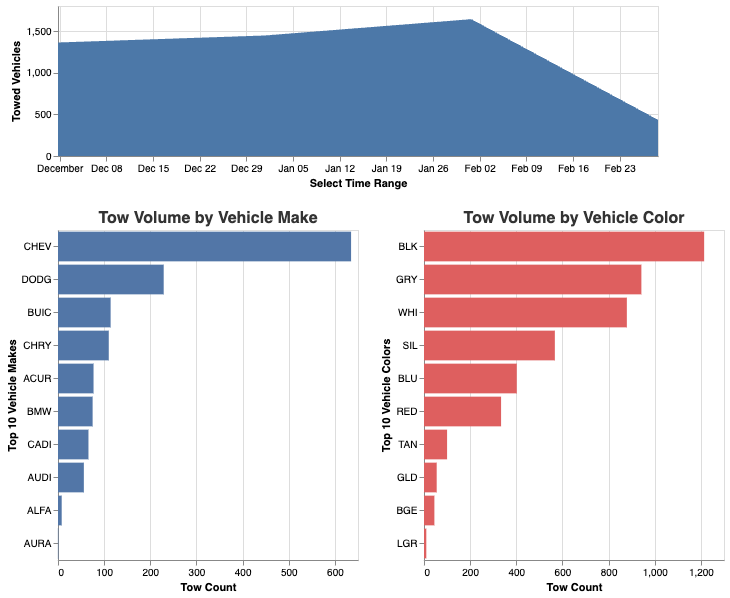
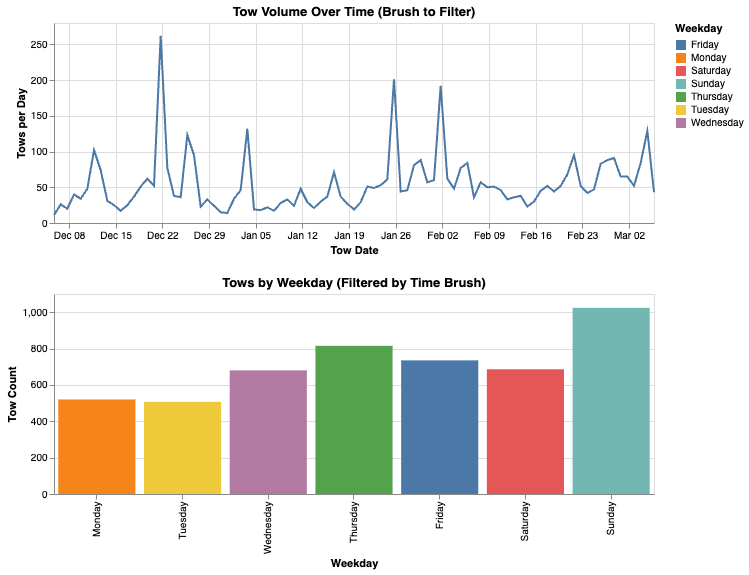

# Final Project Report: Towed Vehicle Visualization System

**Course**: CS 424  
**Name**: Heer Patel, Zaheer Safi

---

## Task 1: Webpage + Layout

Describe the structure of your webpage:
- `index.html` contains divs for each visualization (`#vis1`, `#vis2`, etc.)
- `style.css` controls layout using percentage widths and responsive styles
- `main.js` dynamically loads data and renders views using Vega-Lite

---

## Task 2: Data Preprocessing

### Overview
The original dataset contained raw towed vehicle records, including attributes such as vehicle make, color, tow date, and location. To optimize performance and ensure meaningful visualizations, preprocessing was performed to generate smaller, visualization-ready files.

### Steps Taken

- **Aggregation and Filtering**:
  - Removed entries with `Count = 0` to eliminate irrelevant rows.
  - Grouped by `Make`, `Color`, and `Tow Date` to calculate total tows (`Count`) per attribute.

- **Date Transformation**:
  - Created a new column `TowDateOnly` (date without timestamp) to support time-based filtering.
  - Extracted `Weekday` from `Tow Date` using Python (`pandas`) for use in interactive bar charts.

- **Color Code Normalization**:
  - Ensured color values (e.g., `"BLK"`, `"GRY"`) were clean, stripped of whitespace, and consistent in case.
  - Used friendly labels in dropdown menus while keeping the data values concise.

- **Spatial File Preparation**:
  - Filtered and cleaned the GeoJSON shape file for Chicago community areas (`areas_cleaned.geojson`)
  - Merged location coordinates from raw tows into a CSV (`IL_lat_lon.csv`) for use in spatial dot plots

### Outputs
Preprocessed files used in the system:
- `make_and_color_filtered.csv`
- `towed_vehicles_with_weekday.csv`
- `IL_lat_lon.csv`
- `chicago_comm_areas_cleaned.geojson`

## Task 3: Reused Interactive Visualizations

### Overview
This task focused on integrating previously developed interactive visualizations into a unified webpage. Two distinct interaction types were reused from earlier assignments:

### 1. Multi-View Interaction via Brushing (`#vis1`)
This view uses **brushing** to filter vehicle tow data across multiple linked charts:

- An **area chart** allows users to brush-select a date range
- Two **bar charts** update based on the brush:
  - One shows the top 10 vehicle `Make`s
  - The other shows the top 10 vehicle `Color`s
- All charts are linked via a shared selection (`brush`)

This is an example of a **multi-view linked interaction**, utilizing `alt.selection_interval()` and dynamic filtering.

### 2. Single-View Brush-Based Filtering (`#vis3`)
A minimal, clean interaction using only two views:

- A **line chart** showing tows per day with brushing
- A **bar chart** showing tow counts by weekday, filtered by the brushed range

Unlike `#vis1`, this uses a single-selection view (`Weekday`) tied to a temporal brush. It highlights a minimal but meaningful interaction pattern: **temporal selection → categorical summary**.

### Interaction Summary

| View      | Type        | Interaction     | Purpose                             |
|-----------|-------------|-----------------|-------------------------------------|
| `#vis1`   | Multi-view  | Brushing        | Top `Make` + `Color` by time range  |
| `#vis3`   | Single-view | Brushing        | Temporal tows → Weekday trend       |

## Screenshots

**Linked Visualizations:**

**Brushed Make/Color Bars:**

  

**Dropdown Filtered View:**

## Multiple Linked View: Dropdown-Based Color Filtering

### Overview
This visualization introduces a new interaction mechanism: a dropdown menu that filters vehicle tow data by color. Users can explore the relationship between vehicle make, tow frequency, and color using two linked visualizations:

- A **bar chart** (left) showing the total number of tows per vehicle make for the selected color
- A **scatter plot** (right) displaying the distribution of towed vehicles by make and color, with point size indicating tow volume

### Interaction
- A **dropdown selector** allows users to choose a vehicle color (e.g., "Gray", "Red", "White", etc.)
- Both charts dynamically update to show only data matching the selected color
- If "All Colors" is selected, no filtering is applied and all tows are shown

### Data Transformations
- Raw CSV data was preprocessed to remove any entries where `Count = 0`, reducing clutter and improving clarity
- Aggregation was applied:
  - For the bar chart: sum of `Count` grouped by `Make`
  - For the scatter plot: sum of `Count` grouped by `Make` and `Color`
- The `Color` field uses internal codes (e.g., `"BLK"`, `"GRY"`) for consistency, while the dropdown displays user-friendly labels

### Visual Encoding
- **X-axis (bar):** Tow count (`TotalCount`)
- **Y-axis (bar):** Vehicle make (top-down sorted)
- **X-axis (scatter):** Vehicle make
- **Y-axis (scatter):** Tow count
- **Point size (scatter):** Tow count (scaled for readability)
- **Point color (scatter):** Vehicle color, mapped via a custom scale

### Design Rationale
This view uses **data filtering** as a new interaction method, in contrast to the brushing-based linking used in Task 3. Dropdown menus allow users to explicitly explore patterns in individual categories without overwhelming the view with all categories at once. The scatter plot provides granularity, while the bar chart summarizes volume.

### Screenshot

## Task 5: Spatial Visualization

### Overview
This visualization integrates spatial data with tow volume to highlight geographic patterns of vehicle towing across Chicago. It combines community area boundaries with point-based heatmap data representing tow destination density.

### Data Sources

- **`IL_lat_lon.csv`**: Preprocessed file containing latitude and longitude coordinates for each "towed to" address, along with aggregated tow `Count`
- **`areas_cleaned.geojson`**: Cleaned GeoJSON file of Chicago's 77 community areas, used for the base map

### Visualization Design

- **Base Layer (Geoshape)**:
  - Displays Chicago community area boundaries in a neutral gray tone
  - Uses `geoshape` mark with `projection: mercator` centered on the city

- **Top Layer (Tow Heatmap)**:
  - Displays individual tow destination points as **circles**
  - **Dot size** is scaled by `Count` to represent volume
  - **Dot color** is scaled using a red gradient to show intensity (e.g., red = high volume)
  - Hover tooltips show the tow address and count

### Interactions & Features

- Zoom-level adjustment and projection scale ensure Chicago is fully visible and proportionally mapped
- Custom `projection` and `center` values ensure the spatial alignment of both layers
- `tooltip` interactivity allows exploration of high-density tow destinations
- Clean styling (neutral base map, color-coded points) ensures clarity and avoids visual clutter

### Design Rationale

Spatial visualization helps reveal **geographic trends** in tow activity, which are not obvious in purely categorical or temporal charts. High-density clusters in specific neighborhoods (e.g., South Side industrial areas or downtown towing zones) become immediately apparent.

This view also demonstrates linking **spatial information** with **quantitative encodings**, helping users connect location with behavior.

**Extra Credit**: `vis2` is dynamically filtered by the shared color dropdown (`colorFilter`), linking spatial view with dropdown logic from `vis4`.

### Screenshot

## Task 6: Formal Description of the Visualization System

This section provides a formal representation of the system following the visual analytics pipeline notation described in the paper. Each visualization is described in terms of data sources, transformations, encodings, views, and interactions.

---

### Dataset and Base Notation

Let `D` represent the original dataset(s):

- `D1`: Towed vehicle dataset (make, color, tow date, etc.)
- `D2`: Tow location dataset (with latitude/longitude)
- `D3`: GeoJSON map of Chicago community areas

---

### Visualization Components

#### 1. `vis1` – Brushing Time Range + Bar Charts

- `T1`: `filter` tow date via brush selection (`I1`)
- `T2`: `aggregate` tow count by `Make` and `Color`
- `E`: `x` = time / make / color, `y` = count, `color` = fixed
- `V`: Area chart + 2 bar charts
- `I1`: Brush selection over time
- Feedback: `I1 → T1 → V`

#### 2. `vis3` – Brushed Line to Weekday Bar

- `T3`: `filter` by brushed date (`I2`), `derive` weekday
- `T4`: `aggregate` tow count by weekday
- `E`: `x` = date or weekday, `y` = count
- `V`: Line chart + bar chart
- `I2`: Brushing over line chart
- Feedback: `I2 → T3 → T4 → V`

#### 3. `vis4` – Dropdown-Based Filter: Make/Color

- `T5`: `filter` by `Color` from dropdown (`I3`)
- `T6`: `aggregate` tow count by `Make`, or by (`Make`, `Color`) for stacked bars
- `E`: `x` = count, `y` = make, `color` = color field (stacked), `size` = tow count
- `V`: Bar chart + scatter plot
- `I3`: Dropdown selection (select color)
- Feedback: `I3 → T5 → T6 → V`

#### 4. `vis2` – Spatial Heatmap with Optional Filter

- `T7`: `filter` tow location data by `Color` (`I3`) – shared with vis4
- `E`: `latitude`, `longitude`, `size` = tow count, `color` = count
- `V`: Circle map over community area base
- `I3`: Shared dropdown selection (optional)
- Feedback: `I3 → T7 → V`

---

### Summary

The system supports four core views across multiple coordinated interactions. Each transformation is driven by user input and implemented using Vega-Lite’s parameter and selection architecture. The design uses filtering (`T`), aggregation (`T`), and multiple view coordination (`V`) to support rich visual exploration.
