# CS424 Visualization Project – Towed Vehicles in Chicago

**Website:** [https://zsafi2.github.io/CS424_website/](https://zsafi2.github.io/CS424_website/)

## 📊 Overview

Our project analyzes the **Towed Vehicles dataset** from the Chicago Data Portal, offering a visual and interactive way to explore vehicle towing activity in Chicago. The dataset spans thousands of tows over a 90-day period and includes attributes like tow location, vehicle make/model, date, and registration details.

This dashboard-based visualization suite supports city officials, policy researchers, and the public in understanding:
- When and where towing happens most
- What types of vehicles are most affected
- Whether time, geography, or car model contributes to increased risk of towing

## Data and Processing

**Source:** [Chicago Data Portal – Towed Vehicles](https://data.cityofchicago.org/Transportation/Towed-Vehicles/ygr5-vcbg/about_data)  
**Format:** CSV  
**Attributes Used:** 
- Tow Date 
- Inventory Number
- Plate
- Weekday
- State
- Month_Num
- Towed to Address

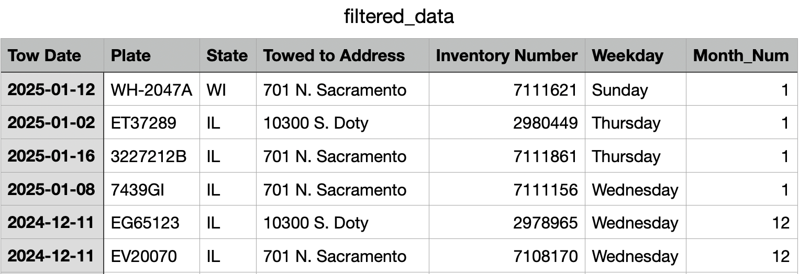

Sample from cleaned and filtered dataset (filtered_data.csv).

### Filtering The Data:

- Drop NA values and select specific columns 
- Parse Tow Date to datetime 
- Applied Imputation method for Plate and State
    - Plates defaulted to “0” for missing values 
    - States missing filled using most frequent state (mode())
- Add Weekday and Month_Num to create specific charts 
- Filter Top 5 States and Top 10 Tow Locations 

## Tools and Techniques

- **Frontend:** Vega-Lite, HTML, GitHub Pages
- **Backend Processing:** Python (Pandas), Jupyter
- **Interaction Design:** Brushing, linked filtering, hover tooltips, cross-highlighting
- **Hosting:** [GitHub Pages](https://zsafi2.github.io/CS424_website/)

## Integrated Views

Our final deliverable is a fully interactive dashboard composed of both **single view visualizations** and **multi-view coordinated displays**.

> Single View Visuals: 
* ### Single View 1: Tow Distribution by State and Weekday (Lollipop Plot)
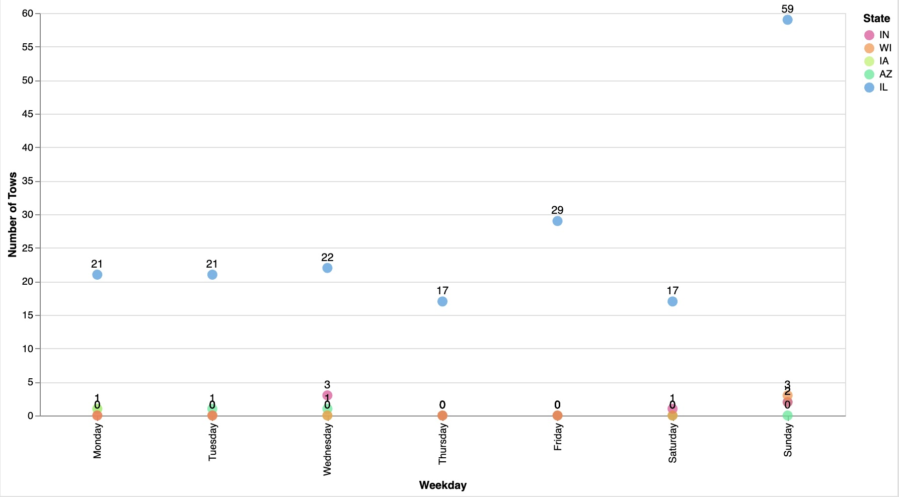
This plot shows lollipop markers representing number of tows per weekday, grouped by state. Illinois leads every day, with Sunday clearly being the clear peak, and minimal counts from other states emphasize localized enforcement.

* ### Single View 2: Tows by Month (Line Chart)
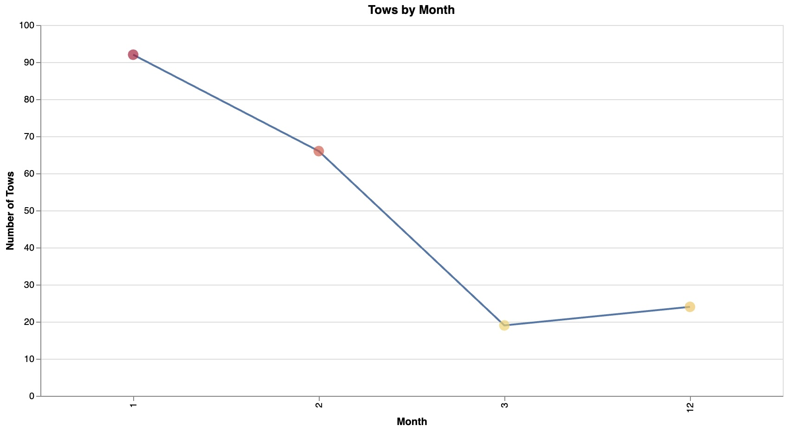
This line chart visualizes the number of tows per month, revealing a sharp decline from January to March. The high values in winter months support the theory of seasonal enforcement policies like snow-related towing.

* ### Single View 3: Tow Volume by Weekday and Location (Heat Map)
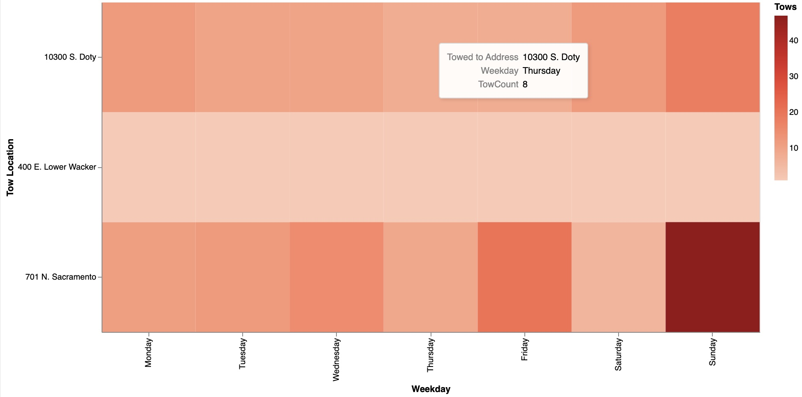
**Caption:** The heat map reveals how frequently vehicles are towed from specific locations on different weekdays. For example, 701 N. Sacramento shows high towing activity on weekends, especially Sundays, suggesting localized enforcement peaks.

* ### Single View 4: Monthly Towing Rank by Vehicle Make (Zoomed Bump Chart)
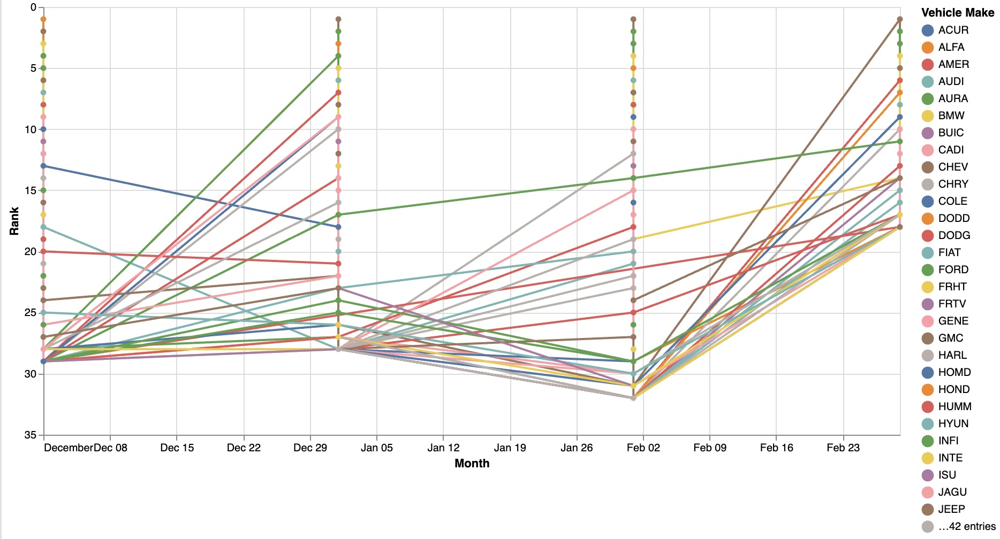
**Caption:** A zoomed-in version of the bump chart, focusing on the lower half of ranked vehicle makes. This view emphasizes more fine shifts among less frequently towed brands, which still reveal temporal towing trends.

> Multiple View Visuals:
* ### Multiple View 1: Weekday Tow Comparison (Jan vs Dec)
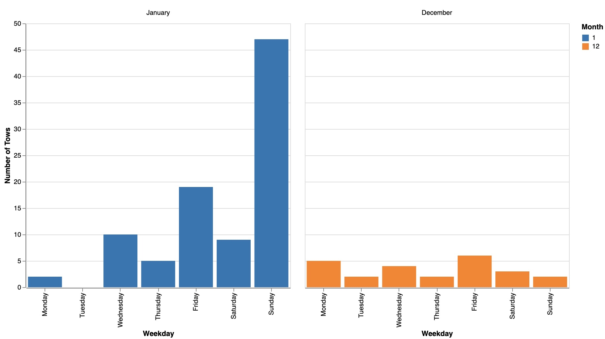
**Caption:** Two side-by-side bar charts compare weekday tow patterns in January and December. January exhibits a steep rise on weekends, especially Sunday, while December remains relatively flat, suggesting less aggressive winter enforcement.

* ### Multiple View 2: Tows by State (Brush to Highlight) & Tow Locations by State (Interactive Highlight)
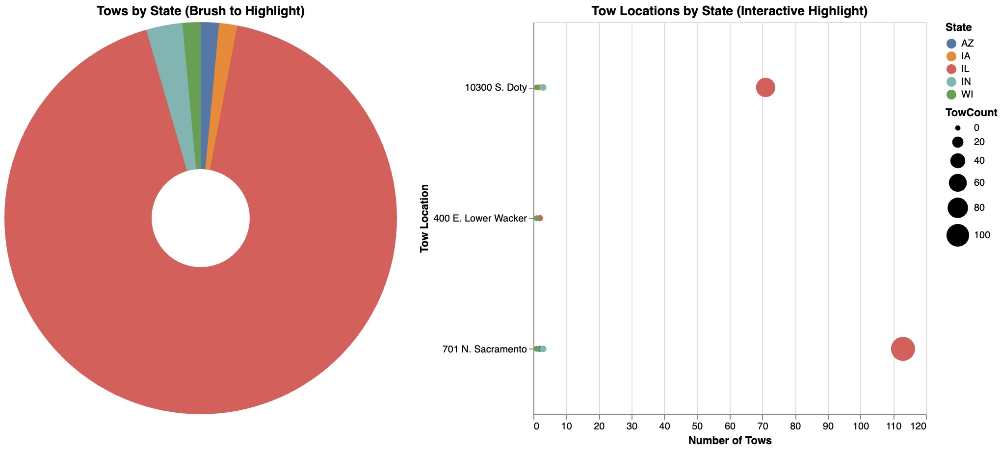
A coordinated view using interactive brushing: selecting a state in the donut chart dynamically highlights related tow locations in the bubble plot. Illinois remains the focal point, with major activity at 701 N. Sacramento and 10300 S. Doty.

* ### Multiple View 3: Tow Location vs Weekday (Heatmap) & Tow Count by Weekday and State
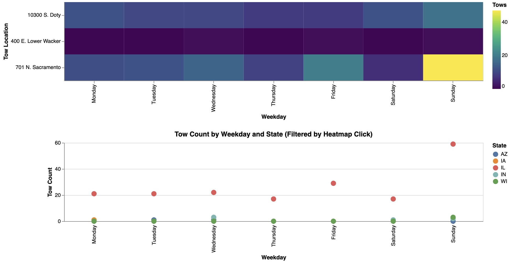
The top heatmap shows weekday tow distribution by location, while clicking it filters the scatterplot below by state. The bottom view reveals that Sunday tows are highest in IL, reinforcing weekend towing enforcement.

* ### Multiple View 4: Total Tows by State (Click to Filter) & Tow Distribution by Weekday (Filtered)
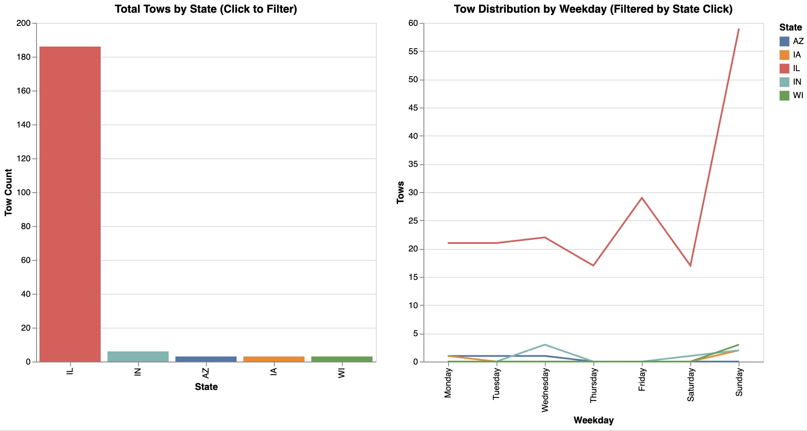
Clicking a state bar on the left filters the line chart on the right by that state. Here, we see that tows in Illinois spike dramatically on Sundays, while other states show minimal weekday variation due to fewer total cases.

* ### Multiple View 5: Tows by Vehicle Color (Click to Filter) & Time Series of Towed Vehicles (Filtered)
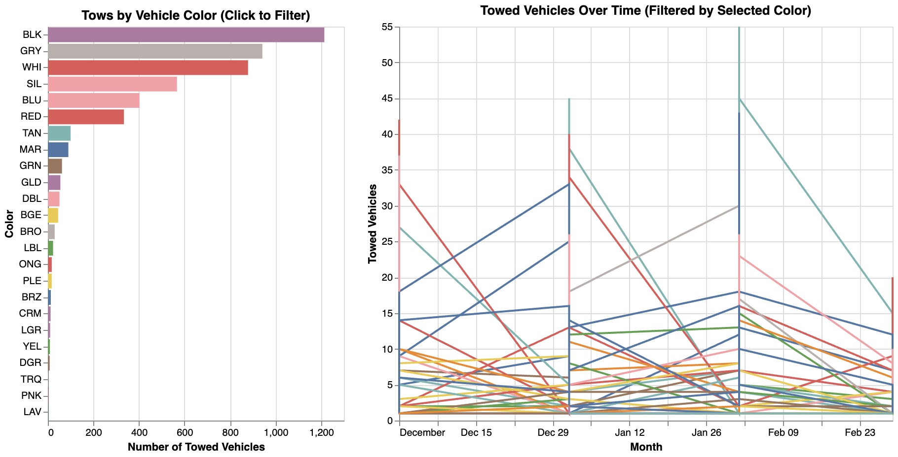
The bar chart displays towing volume by vehicle color, with black, gray, and white being most towed. Selecting a color filters the time series on the right, showing when vehicles of that color were towed across different weeks.

* ### Multiple View 6: Tows by State (Donut) & Tow Locations by State (Bubble)
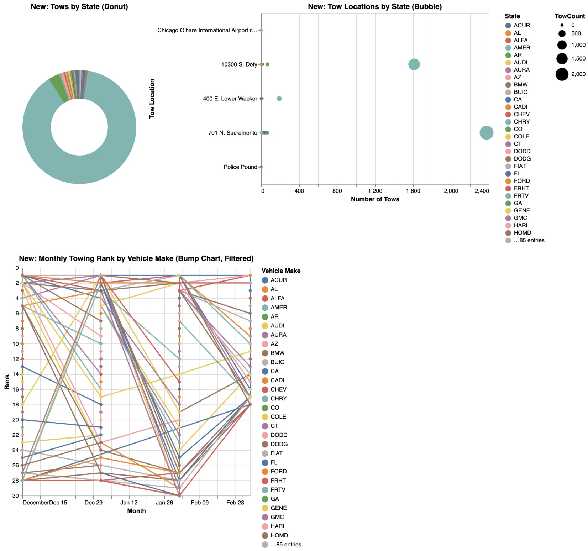
The donut chart shows the proportion of tows by vehicle registration state, where Illinois (IL) overwhelmingly dominates. The bubble chart complements this by showing top tow locations sized by the number of tows and colored by vehicle state, highlighting hotspots like 701 N. Sacramento and 10300 S. Doty. The bump chart tracks how different vehicle makes move up or down in tow frequency rank across multiple weeks. Fluctuating positions indicate changes in enforcement, seasonal patterns, or make-specific behaviors in different months.

## Insights Gained

- **Tow activity spikes in winter months**, especially January and February, likely due to snow routes and parking bans.
- **Sunday is the most active towing day**, probably linked to weekend parking infractions.

## Conclusion

This project sharpened our skills in:
- Data wrangling with real-world CSVs
- Creating meaningful multi-view dashboards
- Developing coordinated, linked visualizations with interaction
- Identifying patterns that could inform public awareness and policy decisions

This dashboard can serve as a valuable portfolio artifact, showcasing our ability to bridge backend analysis with clean, insightful visual frontends.

---

